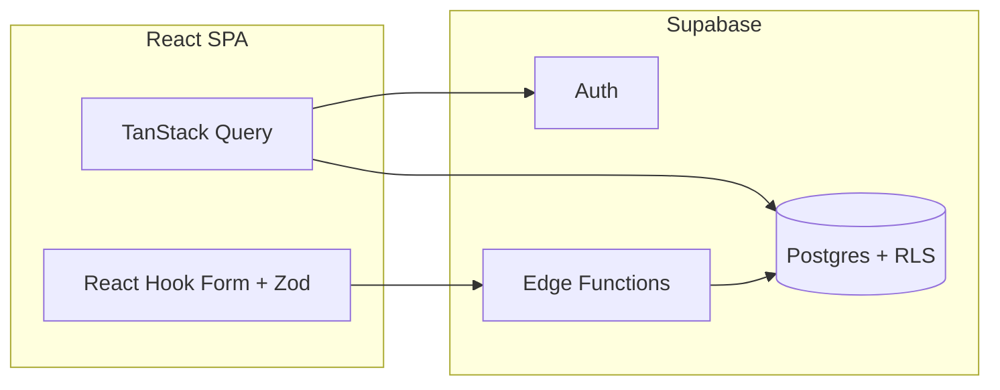

# Admin Organization Dashboard

Production-minded admin dashboard for creating organizations, inviting members, and managing org directories. Built with **React 18 + TypeScript**, **Vite (SWC)**, **Supabase**, **TanStack Query**, **React Hook Form + Zod**, **Tailwind CSS**, and **shadcn/ui**.

## Live URLs

| Environment | Branch        | URL |
|-------------|---------------|-----|
| Production  | `main`        | _Set after Vercel deploy_ |
| Development | `development` | _Set after Vercel deploy_ |

## Test credentials

After seeding (see [Supabase setup](#supabase-setup)):

| Field    | Value |
|----------|-------|
| Email    | `admin@example.com` |
| Password | `Admin123!` |

> Create this user in Supabase Auth, then run `select public.promote_user_to_admin('admin@example.com');` in the SQL editor.

## Features

- **Admin auth** — Email/password sign-in; non-admins are blocked. Sign-up requires an admin registration code validated in the `promote-to-admin` Edge Function.
- **Organizations** — Create School / Nonprofit / Business orgs with type-specific required fields (district, EIN, industry).
- **Member invitations** — Server-side `invite-member` Edge Function validates input, verifies org ownership, prevents duplicate emails.
- **Directory** — Lists orgs you created with type badge, member count, and created date.
- **RLS** — Every table has row-level security; admins only access their own organizations and members.
- **Dark mode** — `next-themes` toggle in the header.

## Branching strategy

```
main          ← production (Vercel Production)
development   ← default working branch (Vercel Preview)
feature/*     ← short-lived branches → PR into development
```

When a milestone is stable, merge `development` → `main`.

## Quick start (local, ~10 min)

### 1. Clone and install

```bash
git clone <your-repo-url>
cd admin-dashboard
npm install
cp .env.example .env
```

### 2. Supabase project

1. Create a free project at [supabase.com](https://supabase.com).
2. Run migrations: **SQL Editor** → paste/run files in `supabase/migrations/` in order, or use the CLI:

```bash
npx supabase link --project-ref <your-ref>
npx supabase db push
```

3. Deploy Edge Functions:

```bash
npx supabase functions deploy create-organization
npx supabase functions deploy invite-member
npx supabase functions deploy promote-to-admin
npx supabase secrets set ADMIN_SIGNUP_CODE=your-secret-code
```

4. Enable Email auth in **Authentication → Providers**.

5. Create the demo admin user and promote:

```sql
-- After creating admin@example.com in Auth dashboard:
select public.promote_user_to_admin('admin@example.com');
```

### 3. Environment variables

`.env`:

```env
VITE_SUPABASE_URL=https://xxxx.supabase.co
VITE_SUPABASE_ANON_KEY=eyJ...
VITE_ADMIN_SIGNUP_CODE=your-secret-code
```

### 4. Run

```bash
npm run dev
```

Open [http://localhost:5173](http://localhost:5173).

## Vercel deployment

1. Import the GitHub repo in Vercel.
2. Set **Production Branch** to `main`.
3. Add environment variables for **Production** and **Preview** (development branch):
   - `VITE_SUPABASE_URL`
   - `VITE_SUPABASE_ANON_KEY`
   - `VITE_ADMIN_SIGNUP_CODE` (optional, for sign-up page hint only)
4. Assign the `development` branch to the Preview environment for a stable dev URL.

## Architecture



| Edge Function | Purpose |
|---------------|---------|
| `create-organization` | Zod validation + insert org as authenticated admin |
| `invite-member` | Verify ownership, dedupe email, create invitation record |
| `promote-to-admin` | Validate signup code, set `is_admin` via service role |

Email sending is stubbed in `invite-member` with a comment where Resend/SendGrid would plug in.

## Data model

- `profiles` — `is_admin` flag, linked to `auth.users`
- `organizations` — `type` enum + conditional columns (`school_district`, `tax_id`, `industry`)
- `organization_members` — `email`, `status` (`invited` \| `active`), unique per org+email
- `organizations_with_member_count` — view for the directory

## Tradeoffs & shortcuts

- **No real email delivery** — invitation records only; send hook is documented in the Edge Function.
- **No invitation accept flow** — stretch goal; member stays `invited` until manually updated.
- **Single Supabase project** — dev/prod split is optional; use separate projects for stricter isolation.
- **Admin promotion** — uses service role in Edge Function; client cannot self-elevate (DB trigger enforces).

## With another day

- Invitation accept flow (magic link → sign-up → link `user_id`, set `active`)
- Playwright E2E: sign-in → create org → invite
- Org search/filter and role-based permissions within orgs
- Separate Supabase projects for Vercel preview vs production

## Loom

_Record your walkthrough and add the link here._

## License

MIT
